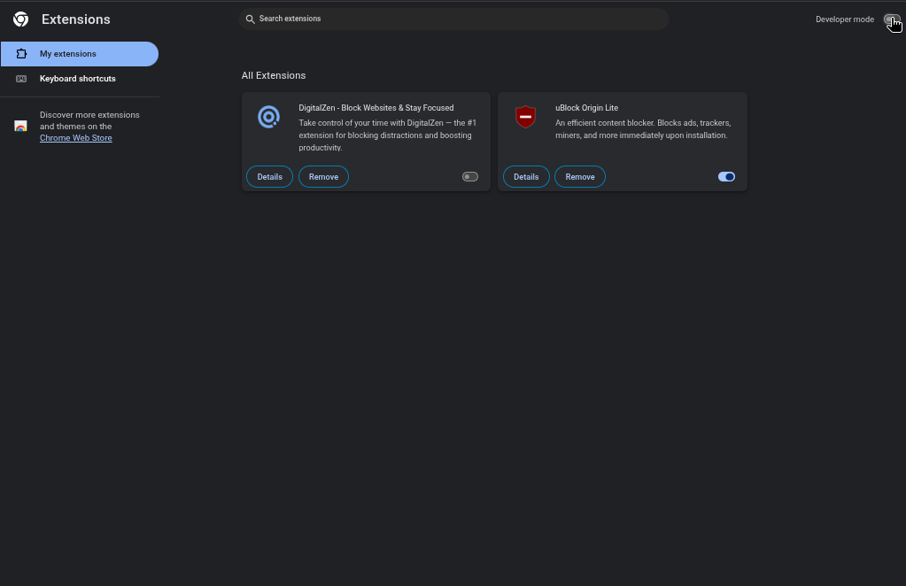
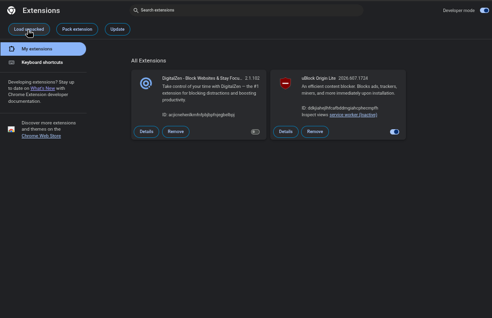

# NewtCBT-Utils

NewtCBT-Utils is the official companion extension for NewtCBT. It seamlessly powers your web search and AI search features, acting as a bridge between the NewtCBT platform and your browser to extract real-time AI insights.

## Installation Guide (Google Chrome)

Follow these simple steps to install the extension manually:

1. **Open Extensions Page**: Type `chrome://extensions/` into your Chrome address bar and hit Enter.
2. **Enable Developer Mode**: Look at the top right corner of the extensions page and toggle the **Developer mode** switch so that it is turned ON. 
   
   

3. **Load Unpacked**: A new menu bar will appear at the top left of the screen. Click on the **Load unpacked** button.
   
   

4. **Select the File**: When the file browser window opens, simply select the downloaded zip file directly to load the extension. 

You're all set! The companion extension is now active and ready to enhance your AI searches.